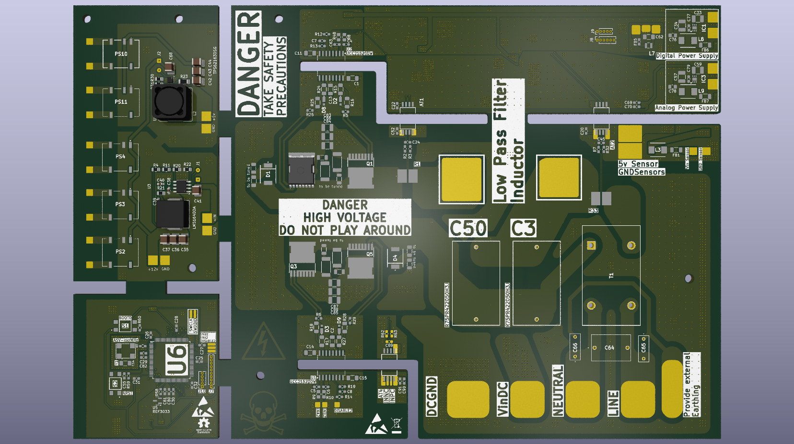

# STM32G4-Pure-Sine-Wave-Inverter

A 1kW Two-Stage Pure Sine Wave Inverter based on the STM32G474 microcontroller.

The project converts a three-phase AC source into a regulated 400V DC link and then generates a low-distortion 230V RMS 50Hz pure sine wave output using SPWM-controlled full-bridge inverter topology.

## Specifications

| Parameter | Value |
|------------|------------|
| Output Power | 1kW Peak |
| Continuous Power | 800W |
| Output Voltage | 230V RMS |
| Output Frequency | 50Hz |
| DC Bus Voltage | 400V |
| Switching Frequency | 20kHz |
| Controller | STM32G474QETx |
| Modulation | Unipolar SPWM |
| Output Filter | LC Low Pass |
| Target THD | <3% |

## System Architecture

3 Phase AC
      │
      ▼
Rectifier
      │
      ▼
400V DC Link
      │
      ▼
Full Bridge Inverter
      │
      ▼
LC Filter
      │
      ▼
230V RMS 50Hz Output

## Features

- STM32G474-based control system
- 20kHz SPWM generation
- Isolated gate drivers
- Current sensing
- Voltage sensing
- LC output filtering
- High-voltage DC link architecture
- Modular PCB design
- Future-ready closed-loop control architecture

## Hardware Overview

### Power Stage
- Full bridge MOSFET inverter
- 400V DC bus
- LC output filter

### Controller Board
- STM32G474QETx
- ADC-based sensing
- PWM generation

### Gate Driver Board
- UCC21520 isolated gate driver

### Auxiliary Power Supply
- High-voltage DC/DC converter
- Isolated supplies

## Development Timeline

1. Topology selection
2. Simulation in PSIM
3. Schematic design
4. PCB design
5. Fabrication
6. Assembly
7. Firmware development
8. Hardware validation
9. Final testing

## Team

Project Team:

- Arafat Babar
- Vedant Acharya
- Krisha Pandya
- Ketan Pitroda
- Dev Bhavsar
- Yash Patel
- Raj Gediya
- Pritha Patel

Guides:

- Prof. Ketan Bhavsar
- Prof. Ankit Chauhan

## Design Notes and Lessons Learned

This project was developed as part of an academic power electronics course and represents a significant learning experience for the entire team.

While the system successfully demonstrates the design and implementation of a 1 kW STM32G4-based pure sine wave inverter, the current hardware revision is not without limitations. During development and review, several design decisions were identified that could be improved in future revisions.

Some areas identified for improvement include:

* PCB layout optimization for high-current switching paths.
* Improved isolation and creepage/clearance considerations in certain sections.
* Better placement of decoupling and filtering components.
* Additional protection circuitry and fault handling mechanisms.
* Improved EMI/EMC design practices.
* More comprehensive thermal analysis of power-stage components.
* Further validation of sensing and feedback circuitry under varying operating conditions.

This repository is intentionally published in its current state to document the complete engineering journey, including mistakes, trade-offs, design iterations, and lessons learned.

Engineering progress comes from testing assumptions, identifying weaknesses, and continuously improving designs. Future revisions will incorporate the insights gained from this prototype.

## Known Issues

The current revision contains several areas that will be revisited in future versions:

* Some PCB footprints and placements could be optimized for assembly and serviceability.
* High-current routing can be further improved to reduce loop inductance.
* Additional test points would simplify debugging and validation.
* Certain component selections were driven by availability and academic timelines rather than final production requirements.
* The control firmware is still under active development and tuning.
* The design has not yet undergone long-term reliability testing.

These observations are documented to encourage discussion and to help future iterations of the project.
